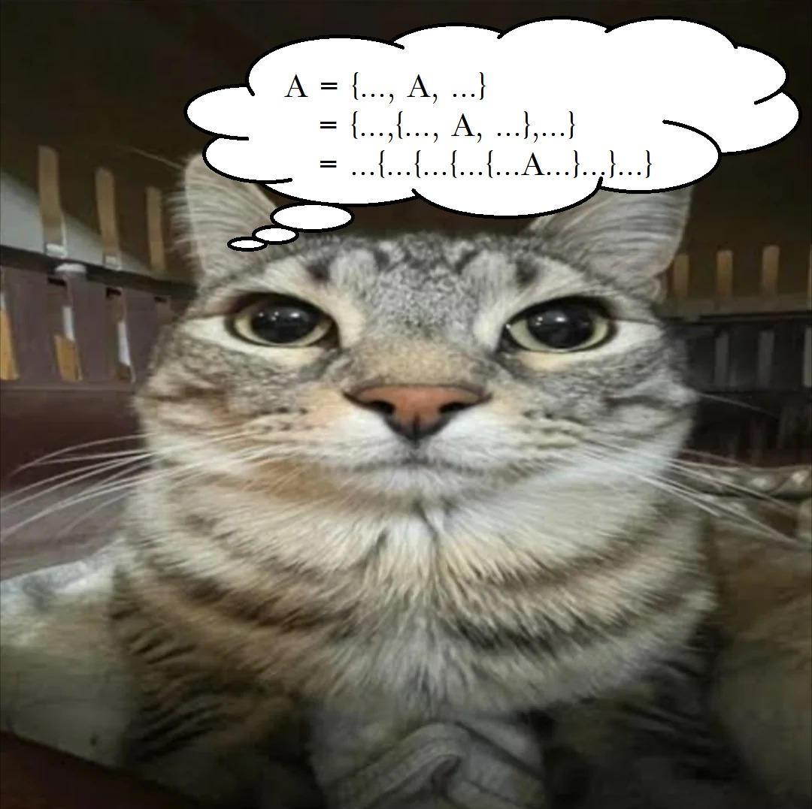
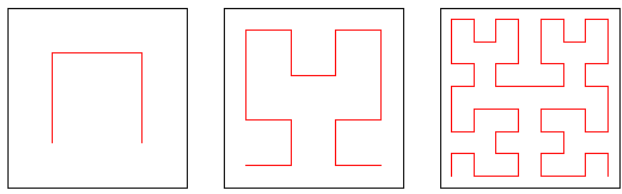
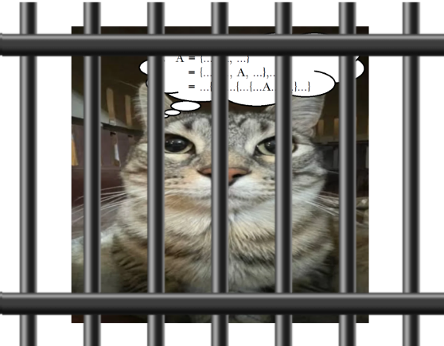
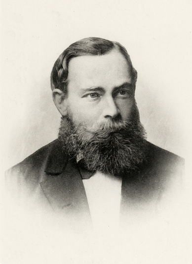
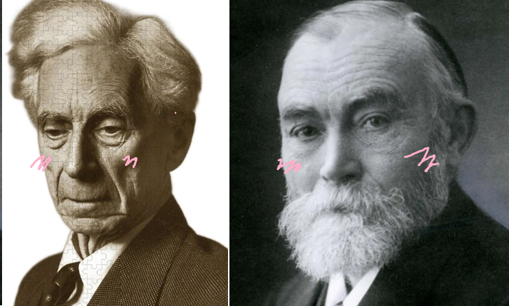

<!-- _class: lead -->

# Embrace the Unknown: <br> Russell's Paradox <br> and The Halting Problem

#### 〜MA274 Final Presentation〜

<br>

Rafay Abid 
Tin Nguyen 

---

<!-- _header: Table of Contents -->

1. Russell's Paradox
1. The Halting Problem
1. 🤯🤯🤯 They're the same?
1. Math is broken ヽ(º ■ º l|l)ﾉ
1. Math is fixed ヽ(・∀・)ﾉ (mostly (ヽ(º ■ º l|l)ﾉ))

---

<!-- _header: Let's entertain a self-containing set, does such a set exists? -->



<!-- 1. Can there be one perfect theory of all sets or all programs? -->
<!-- 2. What happens when a system talks about itself. -->
<!-- 3. Russell’s Paradox → flaw in early set theory. -->
<!-- 4. Halting Problem → limit on what computers can decide. -->

---

<!-- _header: Familiar self-containing structures -->

**Fibonacci sequence:** 
$$
f(n) = f(n - 1) + f(n - 2)
$$

---

<!-- _header: Familiar self-containing structures -->

**Hilbert's Curve**
$$
\begin{aligned}
H(n) = &( 
 H(n - 1) ↶ π/2, &
& H(n - 1), &
& H(n - 1) ↷ π/2  
)
\end{aligned}
$$



---

<!-- _header: What's the beef with sets? -->



---

<!-- _header: Naive Picture of Sets -->

- **A set** = a collection of objects
    - $\{🐱, 😼\}, \mathbb{R}, \cal P(\mathbb{R}),. . .$
- Sets can contain other sets as elements.
- Question: can a set contain itself?
- Tempting idea: consider the set of all sets that do not contain themselves…

---

<!-- _header: Slogan -->

_Is there a barber in town who shaves everyone that doesn't shave themself?_

---

<!-- _header: The Russell Set. Suppose a set of all sets exists... -->

Let $\textcolor{blue}{R} = \{ \textcolor{green}{X} ∈ \text{ SETS} : \textcolor{green}{X} \textcolor{red}{∉}  \textcolor{green}{X} \}$. 

So $\textcolor{green}{X} ∈ \textcolor{blue}{R} \iff \textcolor{green}{X} \textcolor{red}{∉}  \textcolor{green}{X}$

Consider $\textcolor{blue}{R} ∈ \textcolor{blue}{R}$?

**Case 1** $\textcolor{blue}{R} ∈ \textcolor{blue}{R}$. Then $\textcolor{blue}{R} \textcolor{red}{∉} \textcolor{blue}{R} \quad ↯$

**Case 2** $\textcolor{blue}{R} \color{red}∉  \textcolor{blue}{R}$. Then $\textcolor{blue}{R} ∈ \textcolor{blue}{R} \quad ↯$ 


---

<!-- _header: Math is broken ヽ(º ■ º l|l)ﾉ -->

If you build your math on axiomatic set theory, and the set theory falls apart, your entire math falls apart...

$$
\begin{aligned}
&0 = ∅ \\
&1 = \{∅\} \\
&2 = \{∅, \{∅\}\} \\
&3 = \{∅, \{∅, \{∅\}\}\} \\
&\vdots
\end{aligned}
$$


---

<!-- _header: Math is broken ヽ(º ■ º l|l)ﾉ -->

If you build your math on axiomatic set theory, and the set theory falls apart, your entire math falls apart...

$$
\begin{aligned}
&0 = ∅ \\
&1 = \{∅\} \\
&2 = \{∅, \{∅\}\} \\
&3 = \{∅, \{∅, \{∅\}\}\} \\
&\vdots
\end{aligned}
$$


---

<!-- _header: Math is broken ヽ(º ■ º l|l)ﾉ: Frege's Appendix -->




_"Hardly anything more unfortunate can befall a scientific writer than to have one of **the foundations of his edifice shaken after the work is finished**. This was the position I was placed in by a letter of Mr. Bertrand Russell, just when the printing of this volume was nearing its completion."_ \- Gottlob Frege, Grundgesetze Vol. 2


---

<!-- _header: The Halting Problem: Motivating Question -->

_The inifinite loop is a common bug. Can I write a program to detect if a given program and input will continue to run forever or not (halt)?_

---

<!-- _header: The Halting Problem: Motivating Question -->

_The inifinite loop is a common bug. Can I write a program to detect if a given program and input will continue to run forever or not (halt)?_

**Proposition: No** 

---

<!-- _header: The Halting Problem: Proof -->

Suppose such a program exists, call it `checkhalt`:

```python 
def checkhalt(another_program):
    # black magic to check ✨
    if the_program_will_halt:
        return True
    return False
```

Then, define another program, call it `annoying`:
```python
def annoying(another_program):
    if checkhalt(another_program(another_program))
        while True: pass  # loops infinitely
    return # halts
```

---


```python
def annoying(another_program):
    if checkhalt(another_program(another_program)): # 👈👈👈👈
        while True: pass  # loops infinitely
    return # halts
```

Finally, consider `annoying^2 = annoying(annoying)`. 

**Case 1** `annoying^2` loops inifinitely. \
Then `checkhalt(annoying^2)` is `True`. Which means `annoying^2` halts. 

**Case 2** `annoying^2` halts. \
Then `checkhalt(annoying^2)` is `False`. Which means `annoying^2` loops. 


$↯$

---

<!-- _header: Comparison: Diagonalization -->

<div class="row">

<div> 

$\text{SETS}$

Let $\textcolor{blue}{R} = \{ \textcolor{green}{X} ∈ \text{ SETS} : \textcolor{green}{X} \textcolor{red}{∉}  \textcolor{green}{X} \}$. 

So $\textcolor{green}{X} ∈ \textcolor{blue}{R} \iff \textcolor{green}{X} \textcolor{red}{∉}  \textcolor{green}{X}$

Consider $\textcolor{blue}{R} ∈ \textcolor{blue}{R}$?

**Case 1** $\textcolor{blue}{R} ∈ \textcolor{blue}{R}$. Then $\textcolor{blue}{R} \textcolor{red}{∉} \textcolor{blue}{R} \quad ↯$

**Case 2** $\textcolor{blue}{R} \color{red}∉  \textcolor{blue}{R}$. Then $\textcolor{blue}{R} ∈ \textcolor{blue}{R} \quad ↯$ 
</div>

<div> 
| <br> 
| <br> 
| <br> 
| <br> 
| <br> 
| <br> 
| <br> 
| <br> 
| <br> 
| <br> 
</div>

<div> 

`checkhalt`

`annoying`

`annoying(p)` $\iff \neg$ `checkhalt(p(p))`

<br>

`annoying(annoying)`

`annoying^2` halts $⇒$`annoying^2` loops $↯$

`annoying^2` loops $⇒$ `annoying^2` halts $↯$


</div>

</div>


---

<!-- _header: Math is fixed ヽ(・∀・)ﾉ (kind of) -->

Let $\textcolor{blue}{R} = \{ \textcolor{green}{X} ∈ \text{ SETS} : \textcolor{green}{X} \textcolor{red}{∉}  \textcolor{green}{X} \}$.  \
......................$👆$.....$👆$... Turns out, we CAN'T assume SETS is a set. 

_But what other kind of **"collection"** do we have?_

---

<!-- _header: Math is fixed ヽ(・∀・)ﾉ (kind of):  Zermelo–Fraenkel + Choice Axiom -->

- **Extensionality**: $A = B \iff A ⊂ B ^ B ⊂ A$
- **Power set**: $∀ A, ∃ \cal P(A)$

---

<!-- _header: Math is fixed ヽ(・∀・)ﾉ (kind of):  Zermelo–Fraenkel + Choice Axiom -->
**Comprehension**: If $\color{green}S$ is a set and $P(x)$ is a predicate of set theory, then 

$$
\{x ∈ \textcolor{green}{S}: P(x)\}
$$
is also a set. 

This kills Russell's Paradox. 

---

<!-- _header: Moral of the Story -->

Take the L like a champ. It is not the end of the world if your math fails. You're (you Frege) a pretty cool guy. 



--- 

# No self-referencing sets!!!!


